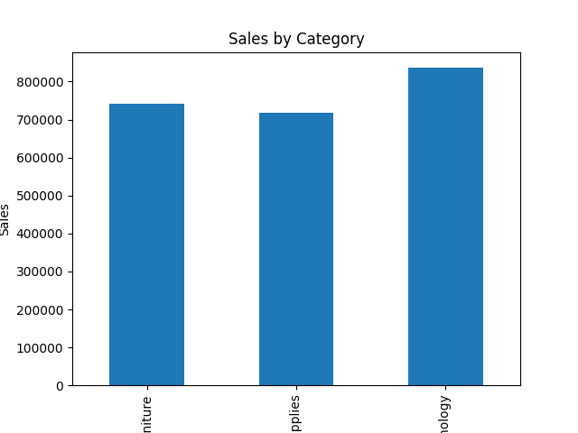
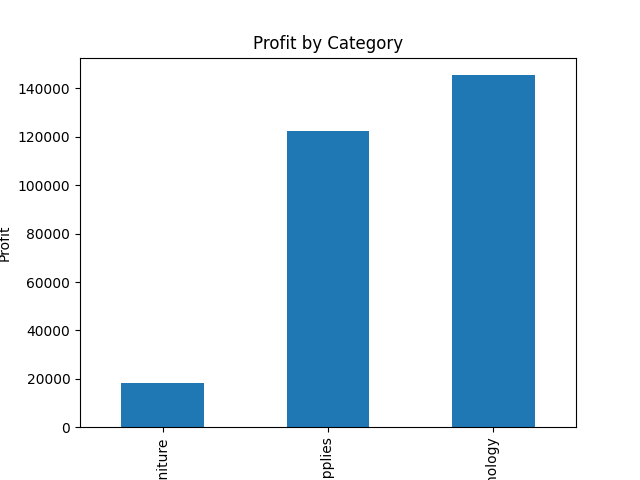
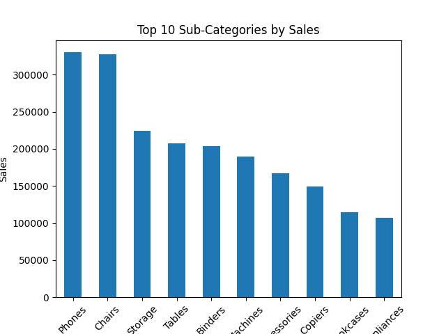
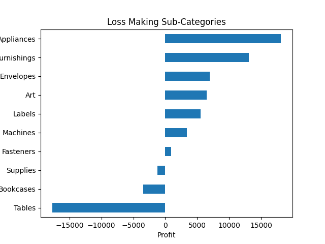
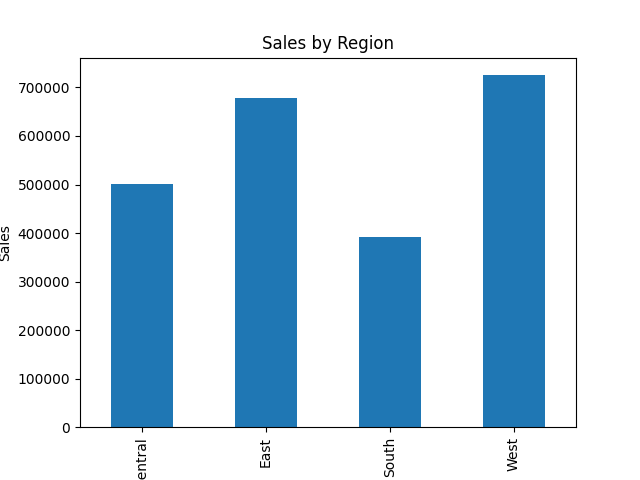

# 🛒 Sales Analysis Project

## 📌 Objective
To analyze retail sales data and extract meaningful business insights.

## 🛠 Tools Used
- Python
- Pandas
- Matplotlib

## 📊 Dataset
Sample Superstore dataset containing sales, profit, and regional data.

## 🔍 Analysis Performed
- Data cleaning (removed null values & duplicates)
- Sales analysis by category
- Profit analysis by category
- Top-performing sub-categories
- Loss-making sub-categories
- Sales distribution by region

## 📈 Key Insights
- Technology category generates highest sales
- Some sub-categories are generating losses despite good sales
- Regional performance varies significantly
- Identified top and underperforming product segments

## 📊 Visualizations

### Sales by Category

### Profit by Category

### Top Sub-Categories

### Loss Making Sub-Categories

### Sales by Region

## 📂 Project Files
- `analysis.py` → Python code  
- `SampleSuperstore.csv` → Dataset  

## ✅ Conclusion
This project demonstrates how data analysis can help businesses identify profitable areas and improve decision-making.
